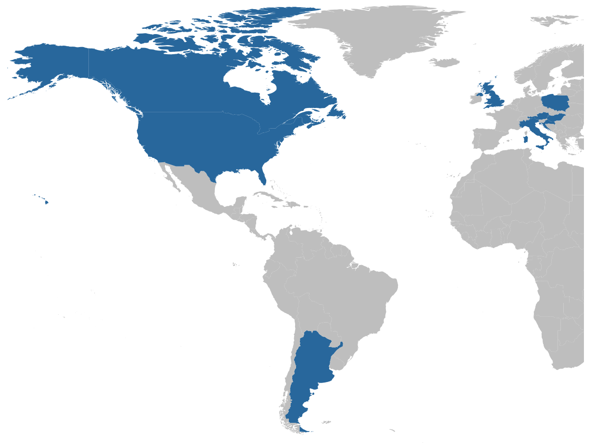

```{r setup, include = FALSE}
library(knitr)
library(kableExtra)
library(tidyverse)
library(papaja)
library(flextable)
r_refs("r-references.bib")

# Load files
data <- read_csv("manydogs_etal_2024_data.csv", show_col_types = FALSE)
data_rows <- nrow(data)
codebook <- read_csv("manydogs_etal_2024_codebook.csv", show_col_types = FALSE, col_select = c(1:4))
```

```{r analysis-preferences}
# Seed for random number generation
set.seed(42)
knitr::opts_chunk$set(cache.extra = knitr::rand_seed)
```


## (1) Background
<!-- Provide background to the data (1000 words maximum). This might include aim(s), main question(s) intend to addressed, topics covered and related theory including literature references and acknowledgement of all major uses of the data. This section should not constitute a full literature review of the topic area, but instead help highlight the literature that informed the motivation and purpose behind collection of the data and potential for use. Where broad comments are made and a wide variety of sources are available to evidence these claims e.g., that humour can lead to laughter, or a specific measure has questionable psychometric properties, preference should be given to acknowledge sources of evidence created by communities who are currently being, or have historically been, marginalised or discriminated against. -->
ManyDogs is an international research consortium of scientists with a shared interest in the factors driving canine behavior and cognition [@ManyDogsProject.etal.2023]. This consortium actively fosters a diverse community and formalizes a transparent and equitable process for engaging in multi-site collaborative projects related to canine behavior and cognition. In the first ManyDogs study---named ManyDogs 1 [@ManyDogsProject.etal.2023a], we investigated a question of theoretical importance in canine science: Do dogs act on human pointing signals as though they are communicative social cues? Domestic dogs (_Canis familiaris_) have become a popular animal model for investigating behavioral and cognitive evolution due to their shared ecological niche with humans and because they are plentiful, easy-to-access research subjects in many parts of the world. Interest in their putatively innate ability to interact and cooperate with humans has made them particularly popular in comparative studies, especially as they appear to respond to human communicative cues---such as pointing---more accurately and flexibly than other species [e.g., @Brauer.etal.2006]. Though point following behavior in dogs has been widely observed and studied over recent decades [@Miklosi.etal.1998; @Soproni.etal.2001; @Hare.etal.2002; @Kaminski.Nitzschner.2013], there is still disagreement as to the underlying motivation for the behavior. Do dogs respond to pointing because they interpret the gesture as socially communicative [@Hare.Tomasello.1999;@Soproni.etal.2001;@Kaminski.Nitzschner.2013]? Or rather, because dogs have learned to associate human pointing with food rewards [e.g., @Wynne.etal.2008]?

To investigate this question, we used a big team science, single-study approach, modeled after other groups such as ManyBabies [@Frank.etal.2017] and ManyPrimates [@ManyPrimates.etal.2019]. With this method, multiple research teams followed the same experimental protocol, sharing the high cost of behavioral data collection and striving to implement the method in an identical manner. This approach replicated the study simultaneously in different research environments and with different populations.

Under our main hypothesis, we predicted that when dogs saw a pointing gesture paired with _ostensive_ signals, such as eye gaze and dog-directed speech (i.e., calling the dog’s name), they would be more likely to follow the gesture than when no such ostensive cues accompanied the point. If we observed this response across dogs, the result would lend support to the idea that explicitly communicative cues help dogs understand the intention behind the gesture. Such an outcome would suggest that dogs find ostensive cues necessary for understanding pointing, similar to human children [@Behne.etal.2005].  On the other hand, if no difference was observed in point following across the ostensive and non-ostensive conditions (pointing without additional cues), this outcome would suggest that dogs indiscriminately follow pointing. Such a result would suggest that dogs raised by humans may learn to associate pointing limbs with rewards and not necessarily perceive any communicative intention underlying the gesture.

In addition to testing our main hypothesis, we took the opportunity offered by multiple research teams in different sites collaborating on the same study to collect data on sources of inter-site variability that could influence the results. Often, studies by different groups produce inconsistent results [@Rodriguez.etal.2021]. The impact of cultural differences in scientific practice, dog training norms across regions, and of course variation in heritable traits across dog breeds have complicated replication studies conducted by isolated groups, making it difficult to pinpoint the reasons that results differ. By collecting extensive and detailed information about the testing environments and subject population, we achieved a rich and robust dataset that would support investigation about multiple influences on dogs’ behavior previously out of reach.


## (2) Methods
<!-- Describe the methods used for data collection including all sub-headings below as deemed relevant. There is no word limit to this section; we are looking for a carefully detailed account of the data collection methods with sufficient detail to allow replication and meaningful secondary use of the data. -->

## 2.1 Study design
<!-- **Please describe the overall study design as requested here. This section is not about surveys but general study characteristics.** -->
<!-- _Provide a clear overview of the study design. This should involve broader features, for example whether the data is cross-sectional or longitudinal, from online questionnaires or face-to-face interviews. A clear overview of the central foci and variables of the data should be presented, including differentiation of between- and within-participant dimensions wherever relevant._ -->

The ManyDogs 1 study used a cross-sectional, multi-method approach to collecting data. Dog guardians were recruited through the individual research sites’ existing databases and via their respective outreach methods (e.g., social media). Prior to participating in the behavioral tasks at a research site, guardians completed an online survey, providing basic environment and demographic information along with a validated assessment of canine temperament and behavior---the Canine Behavioral Assessment and Research Questionnaire [C-BARQ©, @Hsu.Serpell.2003]. The behavioral tasks included a short series of object-choice warm-ups that acclimated the dog to the space, followed by two experimental pointing conditions. Using a within-subjects design, dogs were tested on two different pointing cues by a trained researcher, ostensive and non-ostensive, in counterbalanced orders across subjects. Response rates to these two styles of pointing were compared within subjects, while additional between-subject variables derived from the survey data supported investigating variability in behavior as a function of demographic and environmental factors.

## 2.2 Time of data collection
<!-- Specific time periods in which the data was collected e.g., December 2020-Febuary 2021, or 1st-15th of May 2019. Date of data collection will not be considered an evaluative criteria of the work.  -->
Data for the study were collected over 13 months, between `r as.character(month(sort(data$date)[1], label = TRUE, abbr = FALSE))` `r year(sort(data$date)[1])` and `r as.character(month(sort(data$date[!is.na(data$date)], decreasing = TRUE)[1], label = TRUE, abbr = FALSE))` `r year(sort(data$date[!is.na(data$date)], decreasing = TRUE)[1])`. Within this time window, research sites were able to decide when to implement the protocol according to the guardian and staff availability (collection dates available in dataset).

## 2.3 Location of data collection
<!-- List regions or countries covered by the data with as much detail as is possible e.g. Data was collected in South-East London, UK or at the University of Bologna, Italy. -->
For the main study, data were collected in 20 research sites across eight countries (Argentina, Canada, Croatia, Hungary, Italy, Poland, UK, USA) on three continents (Figure \@ref(fig:countries)). In addition, an Austrian site recorded only pilot data and is not represented in this dataset. A full list and description of research sites is available in Table S1 of @ManyDogsProject.etal.2023a.

```{r countries, fig.align="center", out.width="80%", fig.cap="ManyDogs 1 data presented here were collected from 20 research sites in eight countries: Argentina, Canada, Croatia, Hungary, Italy, Poland, UK, USA. Pilot data not included in this dataset were collected from a site in Austria."}

```


## 2.4 Sampling, sample and data collection
<!--Describe the sample, including any basic demographic information collected, such as number of respondents, age (M, SD), educational background, socio-economic status, religion, and any other descriptive factors collected that are relevant to study design e.g., length of tenure if occupational in focus. The sampling strategy adopted should be fully detailed, including any payment or benefits offered to participants for participation. Any data that did not contribute to the final data set e.g. missing data or response rates, should also be reported here where relevant. -->
Across all sites, teams behaviorally tested `r data_rows` dogs (M:F = `r nrow(data[data$sex=="Male",])`:`r nrow(data[data$sex=="Female",])`, mean ± SD age = `r round(mean(data$age, na.rm = TRUE), digits = 1)` ± `r apa_num(sd(data$age, na.rm = TRUE), digits = 1)` years [range = `r apa_num(min(data$age, na.rm = TRUE), digits = 1)`-`r apa_num(max(data$age, na.rm = TRUE), digits = 1)`]). Approximately `r apa_num(mean(data$desexed=="Yes", na.rm = TRUE) * 100, digits = 1)`% of the dogs were spayed or neutered, `r apa_num(mean(data$purebred=="Yes", na.rm = TRUE) * 100, digits = 1)`% were of single-breed ancestry (comprising `r length(unique(data$breed))` distinct breeds), `r apa_num(mean(data$owned_status=="Private home", na.rm = TRUE) * 100, digits = 1)`% lived in private homes, `r apa_num(mean(data$owned_status=="Group housing (e.g., working dog kennel)", na.rm = TRUE) * 100, digits = 1)`% lived in group/kennel housing, and `r apa_num(mean(data$owned_status=="Other", na.rm = TRUE) * 100, digits = 1)`% lived in other housing. Complete behavioral data were collected from `r length(data$status[data$status=="Included"])` dogs, and complete survey data were collected from `r length(data$status[!is.na(data$cbarq_miscellaneous_26) & !is.na(data$cbarq_miscellaneous_27)])` dogs. Guardians identified as female (`r apa_num(mean(data$guardian_gender=="Female", na.rm = TRUE) * 100, digits = 1)`%), male (`r apa_num(mean(data$guardian_gender=="Male", na.rm = TRUE) * 100, digits = 1)`%), and nonbinary/other (`r apa_num(mean(data$guardian_gender=="Other", na.rm = TRUE) * 100, digits = 1)`%) with a modal guardian age range of `r sub(" - ", "-", slice_max(count(data, guardian_age), order_by = n)$guardian_age)` years.

## 2.5 Materials/Survey instruments
<!-- **Please describe all survey instruments as requested here. This should describe all materials in the survey for the complete dataset provided here (not just the MD1 dataset).** -->
<!-- _Describe the study materials, constructs measured, stimuli, number of items, participant instructions, and, if applicable, factors in the experimental design. Here, a high level of detail is expected to allow replication, and links to stored copies of the exact materials used are expected (unless under copyright or other such restriction)._ -->

The guardian survey was hosted on Qualtrics (complete survey available at <https://doi.org/10.17605/OSF.IO/7RWPC/>). The survey included dog demographics (name, living situation, sex, neuter status, birth date, breed information, acquisition type), training information (communication style and frequency, training experience, research experience), guardian demographics (gender, age, community type), and C-BARQ. The C-BARQ trainability scale (eight items) was presented first and was included in the pre-registered analysis of pointing [@ManyDogsProject.etal.2023a]. After answering the trainability questions, guardians could decide to submit their responses or continue to complete the remaining six behavior assessment scales. If they continued, they answered questions about aggression (28 questions), fear (18 questions), separation-related behavior (9 questions), excitability (7 questions), attachment/attention-seeking (7 questions), and miscellaneous behavior problems (28 questions), including chasing, chewing, begging, pulling, urinating, defecating, barking, and licking. Most questions used a 5-point Likert scale with a Not Observed option. Some categories included open-ended questions for additional explanations of their dog’s behavior, but we did not include them in our dataset to protect guardian anonymity.

Behavioral data were collected at individual research sites, where guardians brought the dogs in for test sessions. After the dogs acclimated to the testing room, they completed a series of warm-up object-choice tasks in which food was hidden under cups and they had to approach a cup to receive any food rewards hidden underneath [complete methods available in @ManyDogsProject.etal.2023a]. These tests were conducted by two individuals: an experimenter to bait and place the cups and a handler to release the dog to make a choice and recall for subsequent trials (handlers could be either trained researchers or the dog's guardian). 

Sessions started with warm-up trials to familiarize the dogs to the testing procedures. These involved trying to find a food reward placed under a single cup (one-cup warm-ups with four out of seven trials correct) or under one of two cups (two-cup warm-ups with four out of size trials correct). Once meeting the completion criteria, the dogs moved on to two experimental condition sessions with eight trials per condition (condition order counterbalanced between subjects). In the non-ostensive condition, the experimenter cleared their throat to get the dog's attention, showed them the food, and placed food underneath one of two cups behind a visual barrier. They then removed the barrier, gazed at the ground in front of them, cleared their throat again, and pointed to the cup with the food using a contralateral momentary point. In the ostensive condition, instead of clearing their throat, the experimenter said "[dog name], look!" in an engaging voice and they made eye contact with the subject instead of looking at the floor. The two conditions were separated by a one-minute play break and re-familiarization with the testing situation. After the two experimental conditions, the dogs completed an odor control condition with a similar set-up as the ostensive condition, except no point cue was given. The control was intended to determine whether the dogs were using olfactory instead of visual cues to solve the task.


## 2.6 Quality control
<!-- **Please describe the quality control components as requested here. As it states below, describe pilot study, first session video checks, reliability checks, etc.** -->
<!-- _Please list the methods used for quality control in the production of the data. This could include pilot work, attention checks, quality checks (e.g. reliability estimates), lab logs, item non-response management, etc._ -->

Collecting high-quality data was a key objective of ManyDogs 1.  To validate the study design and analysis plan, we conducted a pilot experiment at a single site with 91 dogs. We pre-registered the pilot study at the Open Science Framework (https://osf.io/gz5pj/). The pilot data are not included in this dataset.

For the primary study presented here, we pre-registered the hypotheses, methods, and analysis plan as a registered report at _Animal Behavior and Cognition_ (https://doi.org/10.31234/osf.io/f86jq). Because this study involved multiple sites running the same protocol, we sought to ensure consistent implementation across sites. During a researcher training phase, participating sites were required to submit videos of their team performing the protocol, as well as the full set of videos from the first dog tested. Two project administrators reviewed the videos for all sites and provided feedback on each site's implementation to improve consistency across sites.

Behavioral tests were video recorded and experimenters also live-coded the dog’s responses on paper. Data were compiled across sites through a data entry survey hosted on Qualtrics. Using a survey protected the resulting data file from errors associated with directly editing the file. To measure inter-rater reliability of the live coding of experimental sessions, each site had a research assistant blind to the project’s focus recode a subset of sessions. This recoding resulted in an overall Cohen's kappa of 0.98 with individual sites ranging from kappa = 0.92-1.00.


## 2.7 Data anonymization and ethical issues
<!--Please provide clarification on the ethical approval obtained for the data collection (e.g. which Institutional Review Board). All primary data should be captured under ethical approval. Please list any steps taken to anonymise the data and indicate other issues concerning research ethics (e.g., informed consent, use of pseudonyms, etc.).-->

Each research site participating in this study obtained approval from their respective institutional ethics committee [see Table S1 of @ManyDogsProject.etal.2023a]. All guardians gave informed consent to participate and were free to discontinue from the study at any time.

All identifiable information has been removed from the dataset, including replacing dog names with ID numbers.


## 2.8 Existing use of data
<!--Please list any publications or outputs that have originated from this data. This list should be exhaustive to reflect the contributions made by the data to-date.-->
A portion of the guardian data collected for the ManyDogs 1 study was used and published in:

ManyDogs Project, Espinosa, J., Stevens, J.R., Alberghina, D., Barela, J., Bogese, M., Bray, E., Buchsbaum, D., Byosiere, S.-E., Cavalli, C., Dror, S., Fitzpatrick, H., Freeman, M.S., Frinton, S., Gnanadesikan, G., Guran, C.-N.A., Glover, M., Hare, B., Hare, E., Hickey, M., Horschler, D., Huber, L., Jim, H.-L., Johnston, A., Kaminski, J., Kelly, D., Kuhlmeier, V.A., Lassiter, L., MacLean, E., Ostojic, L., Pelgrim, M.H., Pellowe, S., Salomons, H., Santos, L., Silver, Z.A., Silverman, J.M., Sommese, A., Völter, C., Walsh, C.,
Worth, Y.A., Zipperling, L.M.I., Żołędziewska, B., and Zylberfuden, S. G. (2023). ManyDogs 1: A multi-lab replication study of dogs’ pointing comprehension. _Animal Behavior and Cognition_, 10(3), 232-286.
https://doi.org/10.26451/abc.10.03.03.2023

## (3) Dataset description and access
<!-- The following section should relate specifically to the data file(s) being shared. This section has no word limits. Where you have multiple versions e.g., raw and processed data, please provide the following details for each file. -->
The dataset contains `r nrow(data)` observations of `r ncol(data)` variables described in a codebook and Table \@ref(tab:displayDescription). The dataset contains variables supplied by a survey as well as experimental variables. Data provided by each dog's guardian include demographic information about the dog and guardian, responses to questions about the types and frequencies of the dog's training activities, and answers to the C-BARQ. 

In addition to the data provided by guardians, experimental variables are included in this dataset.  These include information about experimental conditions, proportions of correct choices under ostensive and non-ostensive conditions, whether the correct and chosen option were on the right side of the dog, and whether the dog completed the experiment and was used in the analysis.

## 3.1 Repository location
<!-- Please include a permanent identifier, such as a DOI, that points to the online location of the dataset. If this has already been accessible prior, a new DOI does not need to be made. -->
The dataset for this study is available on the Open Science Framework at <https://osf.io/7rwpc/> (DOI: [10.17605/OSF.IO/7RWPC](https://doi.org/10.17605/OSF.IO/7RWPC)) and on GitHub at <https://github.com/ManyDogsProject/md1_datapaper>.


## 3.2 Object/file name
<!-- Please note the exact name of the file or file set in the repository e.g., Raw_Data.csv -->
The file name for the dataset is `manydogs_etal_2024_data.csv` and the codebook is `manydogs_etal_2024_codebook.csv`.

## 3.3 Data type
<!-- Please describe the type of data using one or more terms e.g. primary data, secondary data, processed data, interpretation of data, or final report. -->
This dataset includes processed data from the ManyDogs 1 study. We have removed identifiable information, recoded data values for consistency, renamed and reordered columns for clarity, and combined survey data submitted by guardians via Qualtrics and behavioral data submitted by research teams via Qualtrics.


## 3.4 Format names and versions
<!-- Please note file format e.g., ASCII, CSV, SPSS, SAS, JPEG, Excel, SQL, etc., and any software required to access the file. -->
The dataset and codebook are provided in a comma-separated (`.csv`) plain text format. There is one version of the dataset with no anticipated additional versions, as data collection has ended.

## 3.5 Language
<!-- Language the data is stored as e.g., American English. -->
The variable names and text values are in English. Though data were collected in other languages (Croatian, Hungarian, Italian, Polish, and Spanish), the Qualtrics surveys were coded to save responses in English.

## 3.6 License
<!-- The open license under which the data has been deposited (e.g. CC0).  -->
The ManyDogs 1 dataset is available under a [CC BY 4.0 license](https://creativecommons.org/licenses/by/4.0/), which allows users to share (copy and redistribute the material in any medium or format for any purpose, even commercially) and adapt (remix, transform, and build upon the material for any purpose, even commercially) this material as long as they give appropriate credit, provide a link to the license, indicate if changes were made, and do not apply legal terms or technological measures that legally restrict others from doing anything the license permits.

## 3.7 Limits to sharing
<!-- If the data is currently under embargo, please give the length and date at which the data will be made open. Otherwise, please note any potential barriers to full sharing of the data e.g., if it contains identifying information, how gatekeeping is maintained. Please note that you will need to provide full access to the journal editors and reviewers for the purposes of peer review, in full confidentiality. -->
The dataset is freely available for download on the [Open Science Framework](https://doi.org/10.17605/OSF.IO/7RWPC). There are no limits to sharing beyond those described in the license.

## 3.8 Publication date
<!-- If already public, please state the date the dataset was published in the repository (dd/mm/yyyy). -->
The dataset was uploaded to the [Open Science Framework](https://doi.org/10.17605/OSF.IO/7RWPC) on 2024-02-06.

## 3.9 FAIR data/Codebook
<!-- Please provide details of how you have made the data conform to FAIR guidelines (Findability, Accessibility, Interoperability, and Reuse; see https://en.wikipedia.org/wiki/FAIR_data). This includes reporting any relevant meta-data and as a minimum should include the details of a data codebook to help independent parties interpret your data file. -->

This dataset is _findable_ through the persistent identifier on the Open Science Framework (DOI: [10.17605/OSF.IO/7RWPC](https://doi.org/10.17605/OSF.IO/7RWPC)), _accessible_ through free availability on Open Science Framework and GitHub, _interoperable_ by using plain-text CSV data files, and _reusable_ with the CC-BY 4.0 license. Metadata are included as codebook here (Table \@ref(tab:displayDescription)) and with the data on Open Science Framework and GitHub.


## (4) Reuse potential
The original data from ManyDogs 1 [@ManyDogsProject.etal.2023a] focuses on dog responses in the two-alternative object-choice task across warm-up, ostenstive, non-ostenstive, and odor control trials. In addition, that dataset includes basic demographics on the dog and guardian, as well as the mean trainability score from the C-BARQ. The current dataset adds information on dog origin and household, dog training experience, guardian communication practices, and the complete C-BARQ profile. The C-BARQ data are quite rich, with sections on training, aggression, fear, separation-related behavior, excitability, attachment and attention seeking, and miscellaneous problem behaviors. Thus, this dataset allows for assessing associations among all of the C-BARQ measures as well as connections to the experimental task data and the other dog and guardian characteristic data.

A key strength of this dataset is its diversity. The data were collected by 20 different research sites in eight countries, allowing the assessment of site effects as well as cultural differences. In addition, while most dogs are kept in private homes, the dataset also includes a subset of dogs kept in group housing at working dog facilities. Finally, breed is included, allowing the exploration of breed differences.

Though the current dataset has expanded survey information about dog and guardian characteristics, the behavioral task data have been summarized at the level of mean choices per subject and experimental condition rather than including individual trial data. Thus, the trial data are not available for analysis in the current dataset. However, the trial data are available in the original dataset, so it is possible to merge the current and original datasets using dog ID as the primary key to gain access to the trial data. An additional limitation is that, though the C-BARQ training survey questions were compulsory for all guardians, the remaining questions were optional to ease the survey burden. As a result, `r length(data$continue_cbarq[data$continue_cbarq == "Yes"])` of the `r data_rows` guardians elected to continue on to the optional questions (though not all completed the survey).


## Contribution Statement 
<!-- _Please list all contributions towards this manuscript, including the contributions of all individuals who helped to collect the data (who may also not be an author of the data paper), including their roles and affiliations at the time of data collection._ -->

The authors made the following contributions. Julia Espinosa: Conceptualization, Data curation, Formal analysis, Funding acquisition, Methodology, Project administration, Supervision, Writing - original draft, Writing - review & editing; Elizabeth Hare: Conceptualization, Data curation, Formal analysis, Methodology, Project administration, Software, Validation, Writing - original draft, Writing - review & editing; Daniela Alberghina: Investigation, Validation, Writing - original draft, Writing - review & editing; Brian Perez: Investigation, Validation, Writing - original draft, Writing - review & editing; Jeffrey R. Stevens: Conceptualization, Data curation, Formal analysis, Methodology, Project administration, Software, Supervision, Visualization, Writing - original draft, Writing - review & editing.

For the original ManyDogs 1 study, data were collected by: D. Alberghina., H.E.E. Alway, J.D. Barela, E.E. Bray, S.-E. Byosiere, C.M. Cavalli, L.M. Chaudoir, C. Collins-Pisano, H.J. DeBoer, L.E.L.C. Douglas, S. Dror, M.V. Dzik, B. Ferguson, L. Fisher, H.C. Fitzpatrick, M.S. Freeman, S.N. Frinton, M.K. Glover, J.E.P. Goacher, M. Golańska, M.
Hickey, H.-L. Jim, D.M. Kelly, V.A. Kuhlmeier, L. Lassiter, L. Lazarowski, J. Leighton-Birch, K. Maliszewska, V. Marra, L.I. Montgomery, M.S. Murray, E.K. Nelson, L. Ostojić, S.G. Palermo, A.E. Parks Russell, M.H. Pelgrim, S.D. Pellowe, A. Reinholz, L.A. Rial, E.M. Richards, M.A. Ross, L.G. Rothkoff, H.Salomons, J.K. Sanger, A.R. Schirle, S.J. Shearer, J.M. Silverman, A. Sommese, T. Srdoc, H. St. John-Mosse, K. Vékony, Y.A. Worth, L.M.I. Zipperling, B. Żołędziewska, and S.G. Zylberfuden.

## Acknowledgments
<!-- Please add any relevant acknowledgements to anyone else who supported the project in which the data was collected, but did not work directly on the data itself. -->
We are grateful to all of the research teams and dog guardians who helped generate these data. We are grateful to James Serpell for allowing us to use the C-BARQ questionnaire.

## Conflict of Interest
The author(s) declare no conflict of interest associated with the publication of this manuscript.

## Funding statement
<!-- If the data, or the project from which it came, required funding, please provide clear detail of this here. For example, if funded by a research council this would include the year of successful receipt of funding, the name of the funding council, and the grant number. -->
We are grateful to the Big Team Science Conference for funding the article processing fee via a grant to JE.

\newpage


# References

::: {#refs custom-style="Bibliography"}
:::

\newpage
\small

``` {r, displayDescription, results="asis", echo=FALSE}
### display NAs as blank
options(knitr.kable.NA = "")
### human readable column names
colnames(codebook) <- c("Category of Variable", "Variable Name",
                        "Question Text", "Possible Response Values")

### convert to kable
codebook_table_latex <- kable(codebook,
                   format = "latex", booktabs = TRUE, longtable = TRUE,
                   caption = "Data codebook for ManyDogs 1 study data") |> 
  kable_styling(latex_options = c("repeat_header")) |> 
  column_spec(1, width = "1.5in") |> 
  column_spec(2, monospace = TRUE) |> 
  column_spec(3:4, width = "3in") |> 
  landscape(margin = "1cm")

# codebook_table_latex

codebook_table_html <- flextable::flextable(codebook) |>
  width(j = 1, 1.45) |> 
  width(j = 2, 1.6) |> 
  width(j = 3:4, 2.25) |>
  fontsize(size = 10) |> 
  font(part = "all", fontname = "Times New Roman") |> 
  set_caption("Data description for complete ManyDogs 1 study data") #|> 
  # kable_styling(latex_options = c("repeat_header")) |> 
  # column_spec(1, width = "1.5in") |> 
  # column_spec(2, monospace = TRUE) |> 
  # column_spec(3:4, width = "3in") #|> 
  # landscape(margin = "1cm")

# codebook_table_html

if (knitr::is_latex_output()) {
  codebook_table_latex
} else {
  codebook_table_html
}

```
